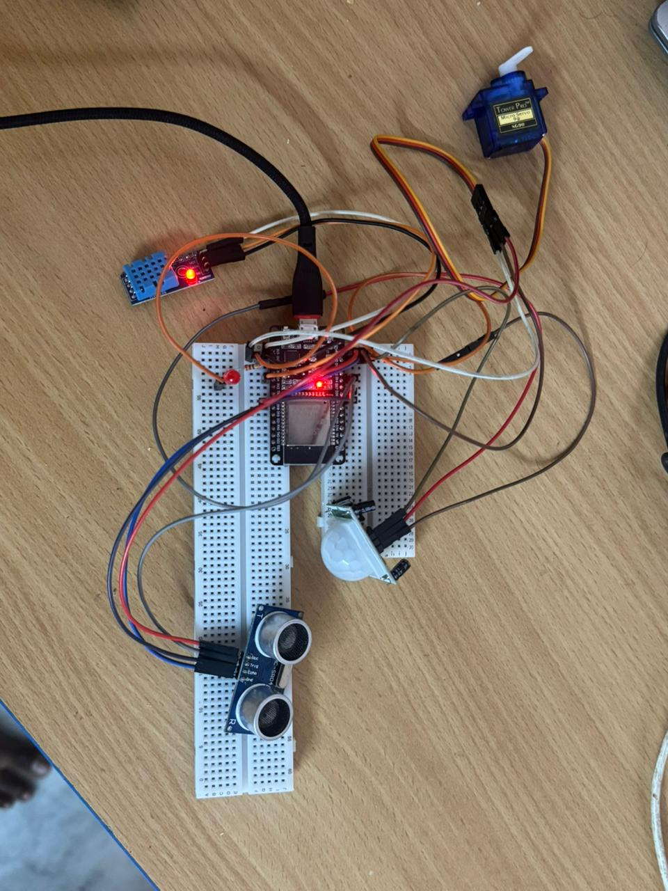
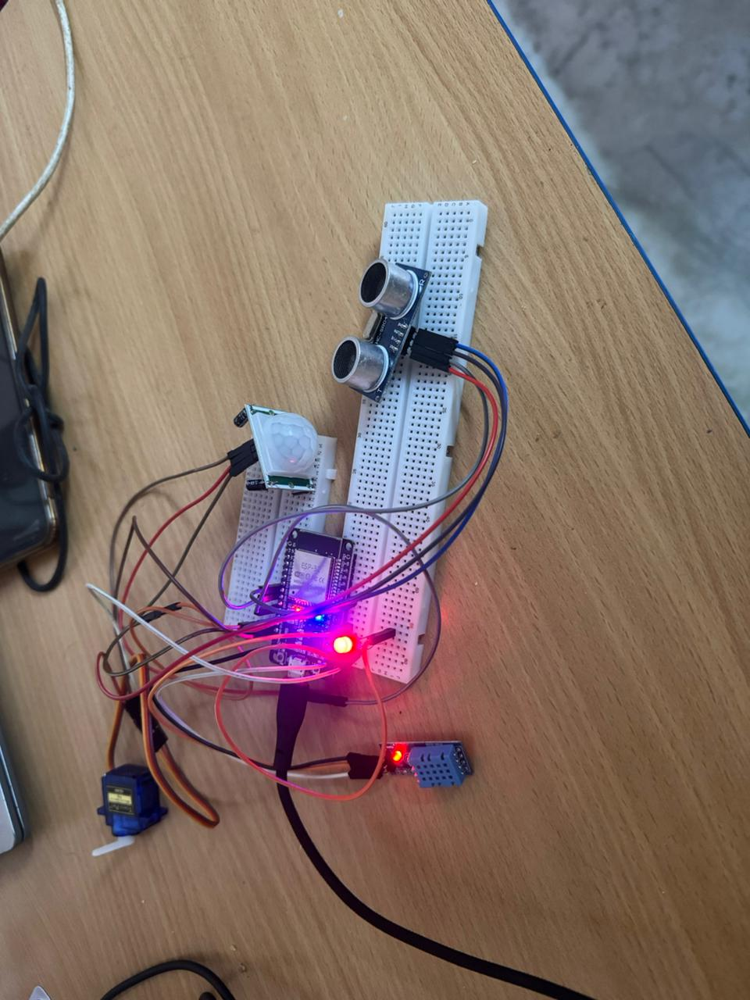

# multi-modal-deep-learning-for-personalized-ai-agents-smart-home
AI-powered gesture-based smart home automation system using CNN (DenseNet121), Reinforcement Learning, and IoT (ESP32). Enables real-time control of appliances like lights and door locks, learns user behavior for personalized automation, and improves accessibility for elderly and differently-abled users without relying on voice commands.

# Overview

This project presents an AI-powered smart home automation system that allows users to control home appliances using hand gestures instead of voice commands. It is designed especially for elderly and differently-abled individuals to improve accessibility, safety, and convenience.

# Features
Real-time hand gesture recognition using CNN (DenseNet121)
IoT-based device control using ESP32
Reinforcement Learning for adaptive automation
Works without internet or voice input
Sensor-based environmental monitoring
Smart decision-making based on user behavior

# Technologies Used
Python
TensorFlow / Keras
OpenCV
NumPy
MediaPipe
Arduino / ESP32
Reinforcement Learning (Q-Learning)

# System Flow

Gesture → CNN Model → RL Decision → ESP32 → Appliance Control

# Methodology
Capture hand gesture using webcam
Preprocess image using OpenCV
Predict gesture using trained CNN model
Reinforcement Learning agent selects optimal action
Command is sent to ESP32
Appliances are controlled (light, door lock)

#  Hardware Components
The system integrates multiple IoT components for real-time smart home automation:
* **ESP32 Microcontroller**
  Main processing unit used for controlling devices and communicating with sensors and actuators.
* **Raspberry Pi (Optional / Processing Unit)**
  Used for running AI models and handling gesture recognition (if deployed on edge device).
* **Ultrasonic Sensor (HC-SR04)**
  Measures distance for proximity-based actions and automation triggers.
* **PIR Sensor (Passive Infrared Sensor)**
  Detects human motion to enable smart activation of devices.
* **DHT11 Sensor**
  Measures temperature and humidity for environmental monitoring.
* **Servo Motor (SG90)**
  Controls door lock mechanism (open/close actions).
* **LED Module**
  Simulates light control (ON/OFF automation).
* **Micro USB Cable**
  Provides power supply and programming interface for ESP32.
* **Breadboard & Jumper Wires**
  Used for circuit connections and prototyping.

# Hardware Working
* The AI model detects hand gestures via webcam.
* The predicted gesture is processed and sent as a command.
* ESP32 receives the command and triggers actions:
  * LED turns ON/OFF (light control)
  * Servo motor rotates (door lock/unlock)
* Sensors (PIR, Ultrasonic, DHT11) provide additional environmental data for smart automation.

# Hardware Output
### 🔹 Smart Home Setup

### 🔹 Working Prototype

# Results
High accuracy gesture recognition
Real-time appliance control achieved
Adaptive automation using Reinforcement Learning
Improved usability for elderly users

# Model Files
Model files are included for demonstration purposes. For better performance, retraining with a custom dataset is recommended.

# Installation
git clone https://github.com/rakeshpara/multi-modal-deep-learning-for-personalized-ai-agents-smart-home.git
cd multi-modal-deep-learning-for-personalized-ai-agents-smart-home
pip install -r requirements.txt

# Usage
python main.py

# Applications
Smart Home Automation
Elderly Assistance Systems
Assistive Technology
IoT-based Intelligent Systems

# Author
Rakesh Para
